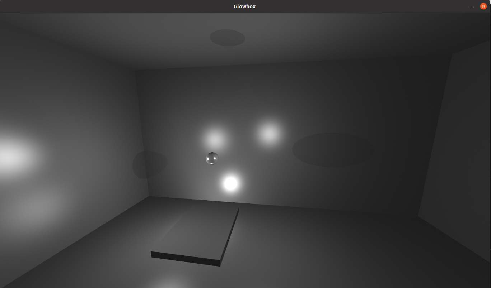
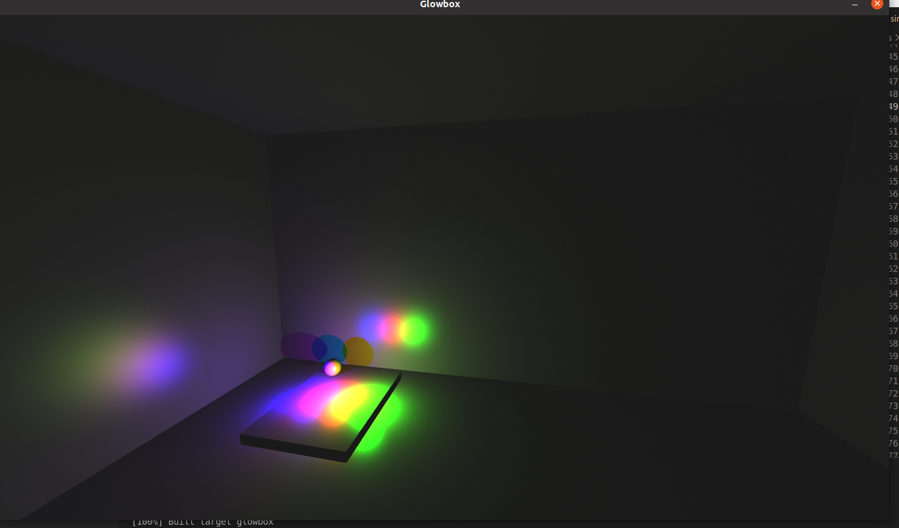

# TDT4230 Assignment 1

## Task 1
Below is a picture of the rendered scene with both ambient, diffuse and specular lighting. Shininess factor = 256.

## Task 2
In the scene there are three light sources: One in the middle of the box, one in the middle of the paddle and one slightly offset from the ball.

# Task 3
Moved all lights to pad with some offsets to demonstrate colour blending

