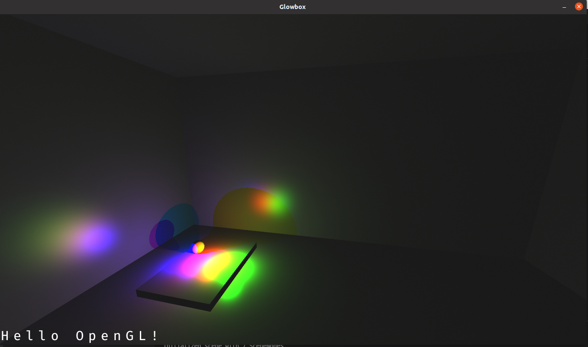

# TDT4230 Assignment 1

## Task 1
Purpose is overrated. Enjoy this picture of some dummy text rendered over the scene.

## Task 2

a) The perspective transformation does not preserve ratios between distances. This causes linear interpolation to give wrong results. Imagine for example that we have a line with points a----b--c----d. If a is further back than d the projected line might look something like a--b-c---d since things further away are drawn smaller. If we were to do a linear interpolation between a and d on this projected line we can tell that the segment between c and d will see much greater changes than the segment between a and b, but if we have a look at our original line we can thell that they should be equal.

b) A displacement map moves verticies around, but since the walls have almost no verticies the displacement map would not be able to do fine grained adjustment. To get some use for a displacement map the wall would need a higher degree of tesselation.

c) When the rectangle is far away I would expect it to gain a green tint. This happens because most implementations of mipmaps do some sort of averaging across the image, and when sufficiently scaled down versions of the texture are used this averaging will have brought some green into the previously red area.